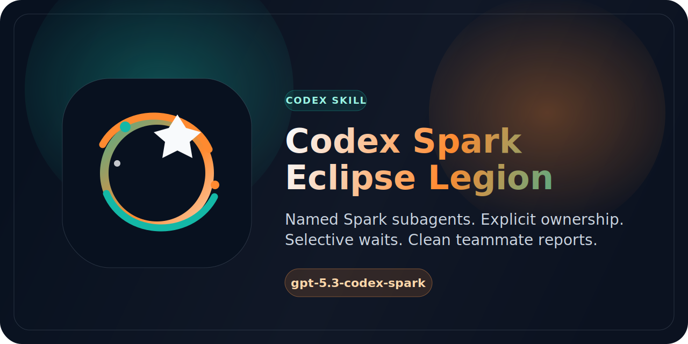

<div align="center">
  
  <h1>Codex Spark Eclipse Legion</h1>
  <p><strong>Summon named <code>gpt-5.3-codex-spark</code> subagents with crisp ownership, short prompts, and teammate-by-teammate reporting.</strong></p>
  <p>
    
    
    
    
  </p>
  <p>
    <a href="./README.md"><strong>English</strong></a> |
    <a href="./README.ja.md"><strong>日本語</strong></a>
  </p>
</div>

## ✨ Overview

Codex Spark Eclipse Legion is a focused skill for moments when one agent is not enough and a giant orchestrator would be overkill. It teaches Codex how to summon a small squad of native Spark subagents, give each one a memorable codename, keep ownership boundaries sharp, and report outcomes teammate by teammate.

The repository now ships a polished public surface:

- a guided English and Japanese README
- a bilingual VitePress documentation site
- reusable SVG identity assets for the README and docs
- GitHub Actions workflows for docs validation and Pages deployment

## ⚡ Quick Start

1. Place this repository somewhere your Codex environment can read it.
2. Use the skill name `codex-spark-eclipse-legion` or mention `$codex-spark-eclipse-legion` in a request when a task benefits from 2-4 parallel subagents.
3. Keep the immediate blocking step local and delegate only the non-blocking sidecar work.

Preview the docs locally:

```bash
npm install
npm run docs:dev
```

Build the docs for CI or Pages:

```bash
npm run docs:build
```

## 🧭 When To Use It

Use this skill when:

- the task splits cleanly into independent tracks such as research slices, QA passes, or file ownership
- the user explicitly wants Spark teammates, aggressive fan-out, or a teammate-by-teammate report
- you want named subagents without dragging in a heavier external orchestrator

Skip it when the next answer is urgently needed on the critical path, when the task is tiny, or when multiple agents would collide on the same files.

## Leadership Model (Main Agent and Subagent Roles)

- The main agent is responsible for management: clarifying intent, defining success criteria, choosing risk tradeoffs, and owning the final answer.
- Subagents are junior teammates who need explicit direction: they execute bounded work and return concise evidence, but should not make final architecture or business decisions.
- Keep the immediate blocking step with the main agent, and treat every subagent task as a sidecar that can be clearly separated and independently verified.
- Every multi-subagent plan keeps Devil's Advocate as a fixed mandatory role inside the same roster.
- If that role cannot be staffed, fan-out is reduced or not run.
- Every producing subagent must use a separate second validation lane (`qa_verifier` or `peer_verifier`) in addition to the main review:
  - this second lane is mandatory per subagent, and may not be replaced by Devil's Advocate.
  - it is required especially for implementation-critical work.
- A subagent is accepted only when:
  - `manager_acceptance = accepted`
  - `second_pass_status = pass`
- Devil's Advocate dispositions (`accepted`/`blocked`/`resolved`) are for overall synthesis risk handling only, not second-pass scoring.
- Required flow:
  - `producer_done -> manager provisional acceptance -> second_pass -> manager synthesis draft -> devil_audit -> final_accept`
- When the flow cannot be satisfied, run fewer subagents or avoid fan-out.

Required function of the Devil's Advocate:
- operate as a cross-slice evidence auditor only: review returned findings, changed file lists, and the manager synthesis draft
- challenge assumptions and premise quality in those inputs
- inspect hidden regressions across subagent slices
- flag premature consensus and evidence gaps before final synthesis
- escalate blockers with owners and required action
- do not perform implementation or final decision-making
- The verification lane is separate from the Devil's Advocate:
  - it validates one producer's output in detail,
  - the Devil's Advocate validates synthesis coherence, cross-slice assumptions, and evidence sufficiency.

Devil's Advocate fixed run order:
- reserve the role before fan-out starts
- after producer outputs and all second-pass results, manager prepares synthesis draft
- `devil_audit` runs on returned findings, changed file lists, and synthesis draft
- final_accept proceeds only after `manager_acceptance=accepted` and `second_pass_status=pass` for every producer.

For each delegation, include all four parts:

- Scope (what must be changed or researched)
- Non-goals (what must not be changed)
- Finish line (expected files, format, and response length)
- QA inventory (how the work will be checked)
- For multi-subagent plans, include a dedicated Devil's Advocate objective and required escalation output.
- QA inventory must include:
  - who is the `qa_verifier` or `peer_verifier` for each producer,
  - what exact acceptance criteria and outputs the second pass uses,
  - how conflicts between subagent output, verifier findings, and main-orchestrator decisions are resolved.

QA inventory example:

- Runbook check: `npm run docs:build` completes without warnings.
- Diff check: only intended files are touched and ownership boundaries are preserved.
- Evidence check: returned notes include concrete checks, risks, and any unresolved items.
- Responsibility check: strategy and final synthesis stay with the main agent.
- Devil's Advocate check: assumptions lacking direct evidence are marked as blockers and returned with owner/action and disposition (`accepted`/`blocked`/`resolved`).
- Per-subagent acceptance check: no item is marked done until both
  - `manager_acceptance = accepted`, and
  - `second_pass_status = pass`.
- Final synthesis readiness check: ensure final synthesis explicitly cites every per-subagent acceptance result before merge or handoff.
- Meaning note:
  - `manager_acceptance` = main-orchestrator acceptance of the producer output.
  - `second_pass_status` = result of independent `qa_verifier` / `peer_verifier` check.
  - `disposition` = Devil's Advocate risk flag (`accepted`/`blocked`/`resolved`) used during synthesis audit.

## 🛰️ What The Skill Enforces

- Dramatic but readable teammate names and epithets
- Explicit ownership for each delegated slice
- Selective waiting instead of reflexively blocking on every agent
- Short final reports that explain who owned what and what came back
- Recovery guidance for thread limits, timeouts, and interrupted runs

The authoritative behavior lives in the root `SKILL.md`. The docs in this repo are the public-facing guide for learning and maintaining that skill.

## 🧱 Repository Layout

- `SKILL.md`: the operational skill definition used by Codex
- `agents/openai.yaml`: a concise interface description for compatible tooling
- `references/prompt-patterns.md`: reusable prompt templates for research, reconnaissance, workers, and review swarms
- `references/recovery.md`: retry and recovery playbook for common orchestration failures
- `docs/`: bilingual VitePress site for onboarding and maintenance

## 📚 Documentation Map

- [Docs home](./docs/index.md)
- [Getting started](./docs/guide/getting-started.md)
- [Usage guide](./docs/guide/usage.md)
- [Architecture notes](./docs/guide/architecture.md)
- [Troubleshooting](./docs/guide/troubleshooting.md)
- [Contributing](./CONTRIBUTING.md)
- [Japanese README](./README.ja.md)

## 🤝 Maintenance Notes

- Keep examples in `SKILL.md`, `README.md`, `README.ja.md`, and `docs/` aligned when behavior changes.
- Prefer short, bounded prompt examples over giant orchestration scripts.
- If you add Python helpers later, run them with `uv run ...` rather than bare `python ...`.
- Use [CONTRIBUTING.md](./CONTRIBUTING.md) as the shared checklist for public-facing updates.

## 📄 License

This repository is released under the [MIT License](./LICENSE).
